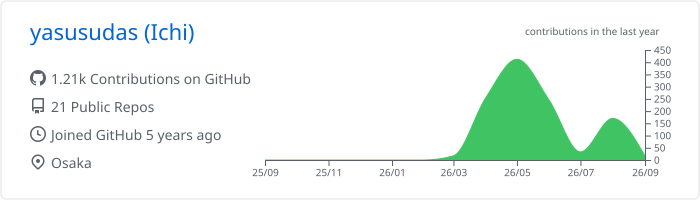
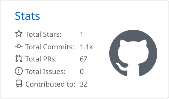
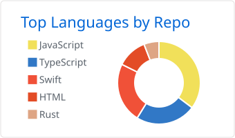

# 安田一惺 / Ichi

立命館大学 情報理工学部 · Student Engineer · Osaka

[Portfolio](https://ichi-portfolio.dev) · [GitHub](https://github.com/yasusudas) · [X](https://x.com/yasusudas) · [Contact](https://docs.google.com/forms/d/e/1FAIpQLSf0GSGbcWOyNelk8tOJyGAokPdfcFrYD1fIoDuxrukXLipz_g/viewform?usp=publish-editor)

## About

立命館大学情報理工学部の学部1回生です。小学4年生からロボットプログラミングを学び、中学時代はPythonでゲームを制作、高校の探究ではNFCなどの無線技術とWeb技術を用いた研究に取り組みました。生成AIを含む新しい技術を試しながら、AI・Web・Media Art・Securityに関心を持って制作しています。

## Selected works

| Project | What I built | Stack |
| --- | --- | --- |
| [立命館OICマップ](https://rits-oic-map.app) | 立命館大学OICの500以上の教室・施設を検索できるWebアプリ | Vanilla JS · Vite · SVG · PWA |
| [とよこう先生サーチマップ](https://toyokousearch.vercel.app) | 校内の先生の位置を確認できるキャンパスマップ | HTML/CSS · Vanilla JS · Google Sheets API · PWA |
| [Puffy](https://ichi-puffy.vercel.app/) | 期限が近づくほど風船が大きくなるタスク管理アプリ | React · TypeScript · Firebase · PWA |

## Background

- **2026.4–present** — 立命館大学 情報理工学部
- **2023.4–2026.3** — 大阪府立豊中高等学校 文理学科
- **Awards** — 大阪府生徒研究発表会 優秀賞 / 豊高プレゼン（研究発表の部）優秀賞
- **Media** — [大阪府立豊中高等学校 学校案内](https://www2.osaka-c.ed.jp/toyonaka/647c844b8e328b8d99924992e7d69311.pdf) に卒業生の声として掲載

## Tech

**Frontend** · HTML · CSS · JavaScript · TypeScript · React · Next.js 
**Languages** · Python · C# · Java · Swift 
**Tools / Infra** · Git · GitHub · Docker · Blender · Unity · Vercel · Google Cloud · Microsoft Azure · Firebase

## GitHub activity

  

  
  

More about me and my work → [ichi-portfolio.dev](https://ichi-portfolio.dev)

