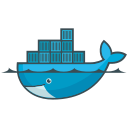

# Ichi

Student Engineer · Osaka

[Portfolio](https://ichi-portfolio.dev) · [GitHub](https://github.com/yasusudas) · [X](https://x.com/yasusudas) · [Contact](https://docs.google.com/forms/d/e/1FAIpQLSf0GSGbcWOyNelk8tOJyGAokPdfcFrYD1fIoDuxrukXLipz_g/viewform?usp=publish-editor)

## Tech Stack

<table>
  <tr>
    <td valign="top" width="50%">
      <strong>Languages / プログラミング言語</strong>  
      

        
        
        
        
        
        
        
        
      

    </td>
    <td valign="top" width="50%">
      <strong>Frameworks &amp; Libraries / フレームワーク・ライブラリ</strong>  
      

        
        
      

    </td>
  </tr>
</table>

<table width="100%">
  <tr>
    <td valign="top" width="50%">
      <strong>Dev tools / 開発ツール</strong>  
      

        
        
        
        
        
        
      

    </td>
    <td valign="top" width="50%">
      <strong>Infrastructure / インフラ</strong>  
      

        
        
        
        
      

    </td>
  </tr>
</table>

## GitHub activity

  

  
  

More about me and my work → [ichi-portfolio.dev](https://ichi-portfolio.dev)

